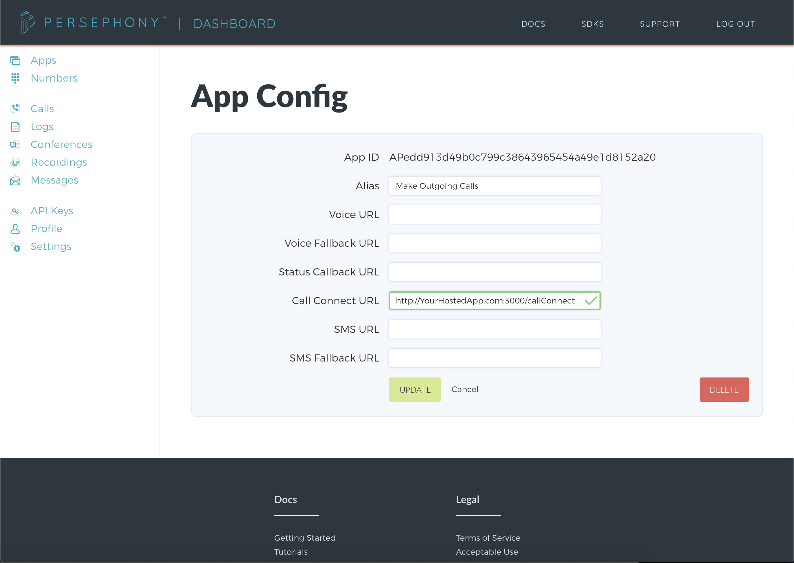
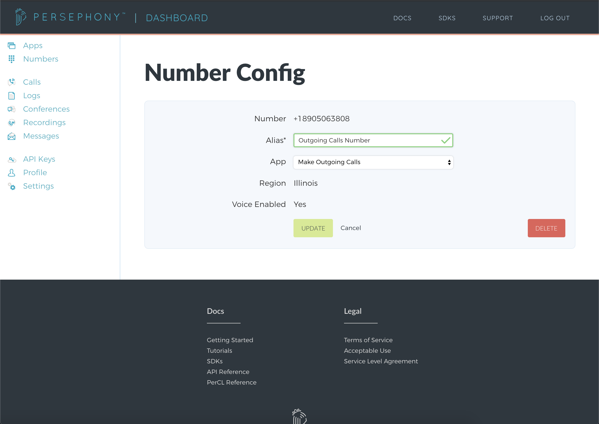

# Making Outgoing Calls Application

This project serves as a guide to help you build an application with FreeClimb. Specifically, the project will:

- Create an outgoing call to the user's phone number from the FreeClimb phone number and play a message for the user.

## Setting up your new app within your FreeClimb account

1. After logging into your FreeClimb account, we will [Get a FreeClimb Phone Number](https://www.freeclimb.com/dashboard/portal/numbers/buy). Users will be receiving calls from this phone number.
2. Next, create a new app using the [Create New App form](https://www.freeclimb.com/dashboard/portal/applications/new).

   When a HTTP Request is sent to our app, FreeClimb will create a new call to the user and then issue an HTTP Request to your application at a given url.

   The app's alias for this tutorial is Make Outgoing Call. This tutorial will use the `Call Connect URL` (with endpoint `/callConnect`).
   

3. Next, link your FreeClimb number to your FreeClimb app. Go to the [My Numbers page](https://www.freeclimb.com/dashboard/portal/numbers) and click on the number you purchased in Step 1. Set the app to your new Make Outgoing Calls Application.
   

## Setting up the Making Outgoing Calls Application locally

1. Clone or download this repo locally. To further understand the processes in this application, additional reading can be found in the [Getting Started Tutorial](https://freeclimb-docs.readme.io/docs/getting-started-with-freeclimb).
2. Install the node packages necessary using command:

   ```bash
   yarn install
   ```

3. Configure environment variables (this tutorial uses the [dotenv package](https://www.npmjs.com/package/dotenv)).

   | ENV VARIABLE            | DESCRIPTION                                                                                                                                                                             |
   | ----------------------- | --------------------------------------------------------------------------------------------------------------------------------------------------------------------------------------- |
   | ACCOUNT_ID              | Account ID which can be found under [API Keys](https://www.freeclimb.com/dashboard/portal/account/authentication) in Dashboard                                                         |
   | AUTH_TOKEN              | Authentication Token which can be found under [API Keys](https://www.freeclimb.com/dashboard/portal/account/authentication) in Dashboard                                               |
   | FREECLIMB_PHONE_NUMBER | FreeClimb Phone Number associated with Making Outgoing Calls Application found under [My Numbers](https://www.freeclimb.com/dashboard/portal/numbers) in Dashboard (**E.164 format**) |
   | FREECLIMB_APP_ID       | Application ID associated with FreeClimb Making Outgoing Calls Application found under [Apps](https://www.freeclimb.com/dashboard/portal/applications) in Dashboard                   |

## Using the Making Outgoing Calls Application to Make Calls

1. Run the application using command:

   ```bash
   $ node index
   Running the application on port 3000.
   ```

2. Hit the /sendCall endpoint with the E.164 formatted phone number that should receive the call (`destination_phone_number`) in the body of the request.

   ```bash
   curl -XPOST http://YourHostedApp.com/sendCall -d '{"destination_phone_number":"+1XXXXXXXXXX"}' -H "Content-Type: application/json"
   ```

3. Expect a call from your FreeClimb phone number to be made to the phone number provided in the request, then the message created in the /callConnect should be played within the phone call.
